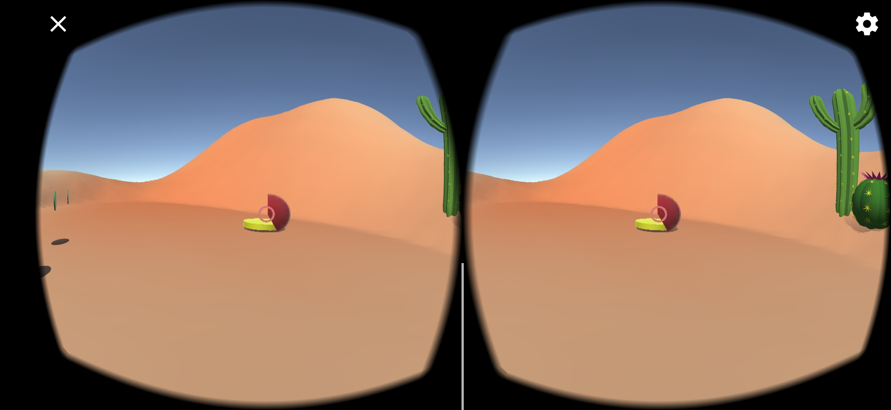
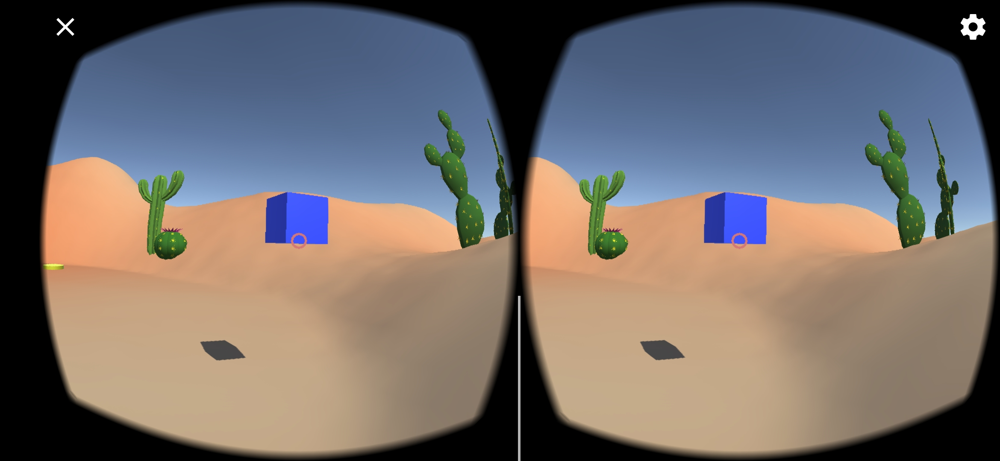

# VR-2020
Virtuelna Realnost 2020

# Домашна бр. 1

 

Домашната е сработена во Unity 2018.4.20f1 (64-bit). Мобилниот уред на кој што тестирам е Huawei P Smart+ (во некои делови од светот познат како Nova 3i).
Во однос на инсталацијата, се помагав со официјалната документација и потребните додатоци.

За основно снаоѓање во Unity ми помогнаа разни туторијали, додека од следниве научив конкретно како да се движам низ околината без input:	

https://www.youtube.com/watch?v=kBTn2pGwZUk&list=PLHQUlKGE3pvz5-8aDjy6pral6ash4-JKu&index=4

https://www.youtube.com/watch?v=ecYezSD4qPg

Во проектот е искористена комбинација на двата.
Движењето нанапред се одвива доколку главата (главната камера) ни е завртена барем 20 степени надолу, 
но не повеќе од 90 степени (гледано по Х оската). Изменета е брзината на движењето, како и висината на играчот. 
Пробав по истиот принцип да додадам движење наназад, но од некој причина не работеше, не успеав да најдам на интернет предлог кој ќе функционира кај мене. 

Сцената е комплетно мој дизајн, при што користев пакет со текстури и објекти од пустина, кој што го симнав од Asset Store.

  

# Домашна бр. 2

  

За интеракцијата со копче преку поглед ми помогна [следниот туторијал](https://www.youtube.com/watch?time_continue=12&v=zdNBZsJdg9c), додека [овој](https://www.youtube.com/watch?time_continue=10&v=zc8ac_qUXQY) ми даде основа за менито кое што го користам.

Интеракцијата е успешна доколку го задржиме погледот на посакуваното копче 2 секунди.

Во апликацијата се додадени 2 нови сцени: Menu и End. 
Започнуваме со Menu, каде што имаме опција да ја започнеме играта, да добиеме повеќе информации преку копчето Intro или пак да излеземе од играта со Quit. 

Во главната сцена можеме да се задржиме само 1 минута. По истекот на ова време апликацијата не носи до сцената End, каде што можеме повторно да започнеме со играта или пак конечно да излеземе од апликацијата.

  

# Домашна бр. 3

  

За потребите на третата домашна работа, овозможени се 3 нови вида на интеракција во рамките на апликацијата. 
 

 
- собирање на парички со помош на [collision detection](https://www.youtube.com/watch?v=kxKny1qWf5Q&list=PLiuDBLn1FK-QOmpA3Vs2JY0DVAj0GfFPn&index=7&t=0s)
- [телепорт](https://www.youtube.com/watch?v=bmMaVTV8UqY&list=PLiuDBLn1FK-QOmpA3Vs2JY0DVAj0GfFPn&index=9) кој ни овозможува да се телепортираме на одредено место доколку гледаме во објектот доволно долго (2 секунди)
- [промена на смерот на ротација на коцка](https://www.youtube.com/watch?v=bmMaVTV8UqY&list=PLiuDBLn1FK-QOmpA3Vs2JY0DVAj0GfFPn&index=9) доколку ја гледаме коцката доволно долго (2 секунди)

 

 

 

   

# Домашна бр. 4

 

Во домашната број 4 во проектот се додадени 2 вида звуци: 2D и 3D. Додадените аудио ефекти се:
- звук при [собирање на паричка](https://www.youtube.com/watch?v=yE0JdtVTnVk)
- [позадински](https://www.youtube.com/watch?v=mqomJmsB-yI) звук
- [3D звук](https://www.youtube.com/watch?v=M88jDVfu6-Q&list=PLiuDBLn1FK-QOmpA3Vs2JY0DVAj0GfFPn&index=7) на ветер, чија јачина се зголемува/намалува во однос на оддалеченоста на играчот од плавата коцка

Користен е еден AudioSource за позадинската музика и друг за собирањето парички, додека за 3D е користен ResonanceAudio.   
Звукот за собирање парички е пронајден во Unity Asset Store, останатите аудио фајлови се преземени од следните линкови:
- [ветер](https://www.noiseforfun.com/2014-sound-effects/wind-gust/)
- [позадинска мелодија](https://opengameart.org/content/desert-calmness-and-fighting-orchestral-141)

   

*Извршните верзии од соодветните домашни (.apk) се наоѓаат во фолдерот builds.*

   

***Драгана Николовска 161285***
